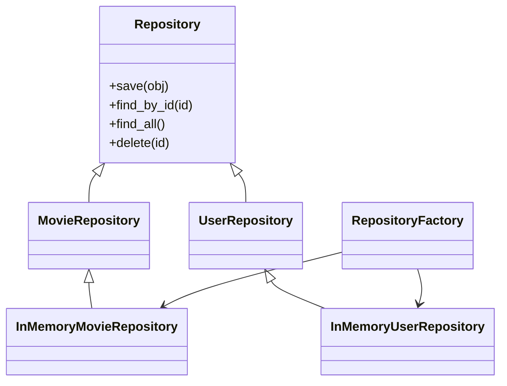

# Class Diagram for Assignment 11

---

## Explanation

The updated class diagram introduces the Repository Pattern into the system architecture.

### Key Design Decisions

- A generic Repository interface was used to define CRUD operations.
- Entity-specific repositories extend the generic repository.
- In-memory implementations store objects using Python dictionaries.
- A RepositoryFactory abstracts repository creation.

### Benefits

- Reduces code duplication
- Improves scalability
- Simplifies maintenance
- Supports future database integration